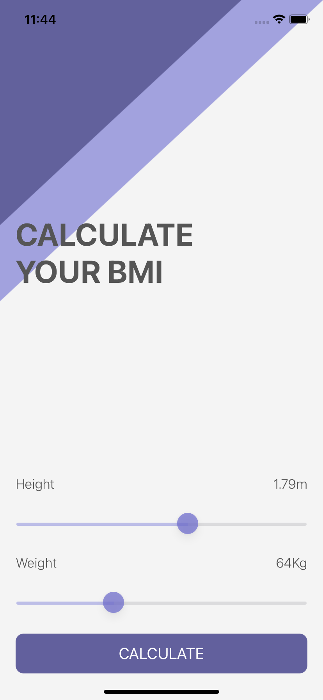
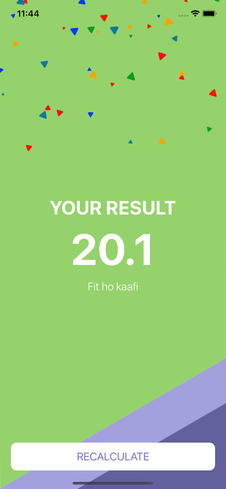

#  BMI Calculator

## What you will create

 A Body Mass Index calculator. Based on the user’s weight and height it will calculate their body mass and give a piece of health advice depending on whether if they have eaten too many pies or if they need to eat more pies.

## Lessons Learned

* How to create multi-screen apps with animated navigation.
* Optional binding, optional chaining and the nil coalescing operator.
* How to create classes and difference between classes and structs.
* Pass by value vs. pass by reference.
* Formatting Strings.
* Color literals.

## Screenshots

 || 
